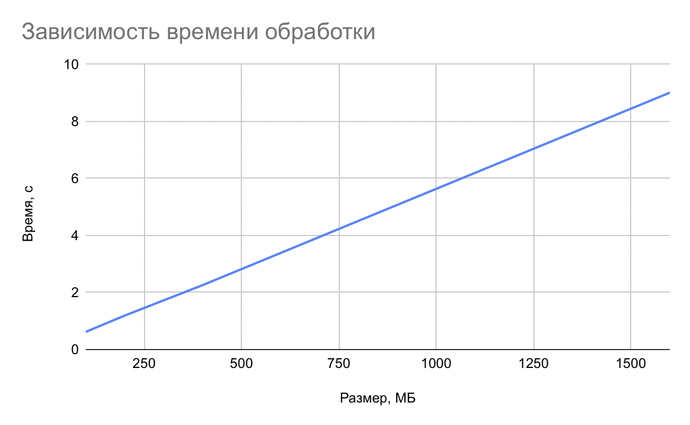
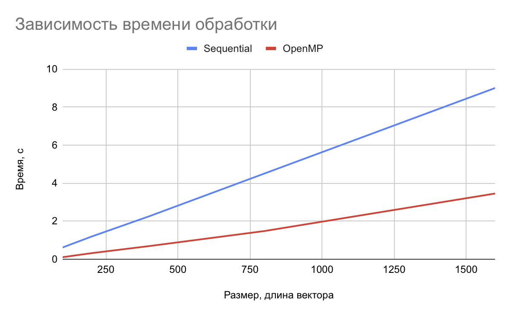
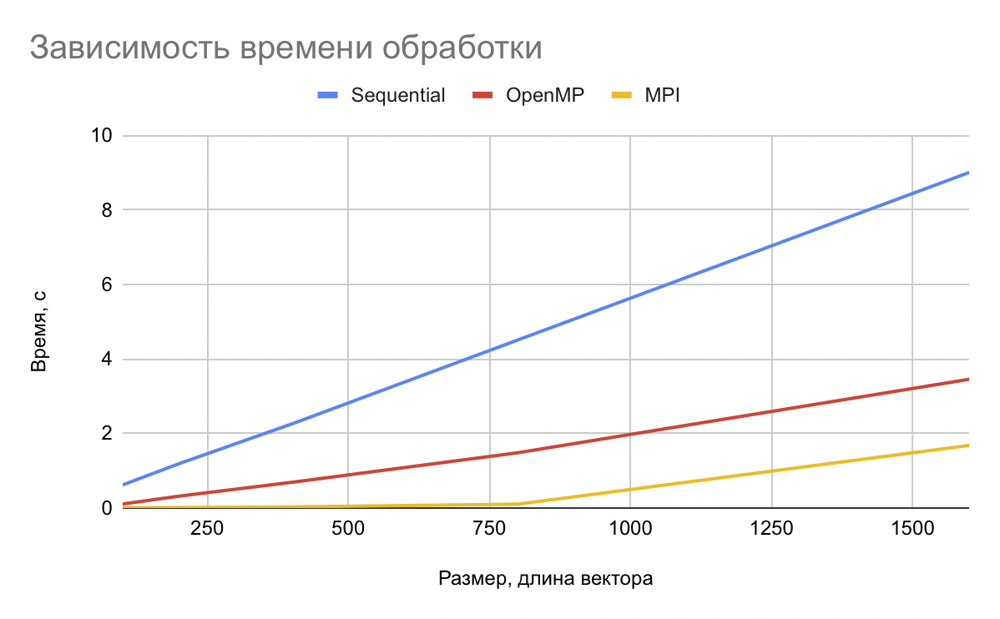
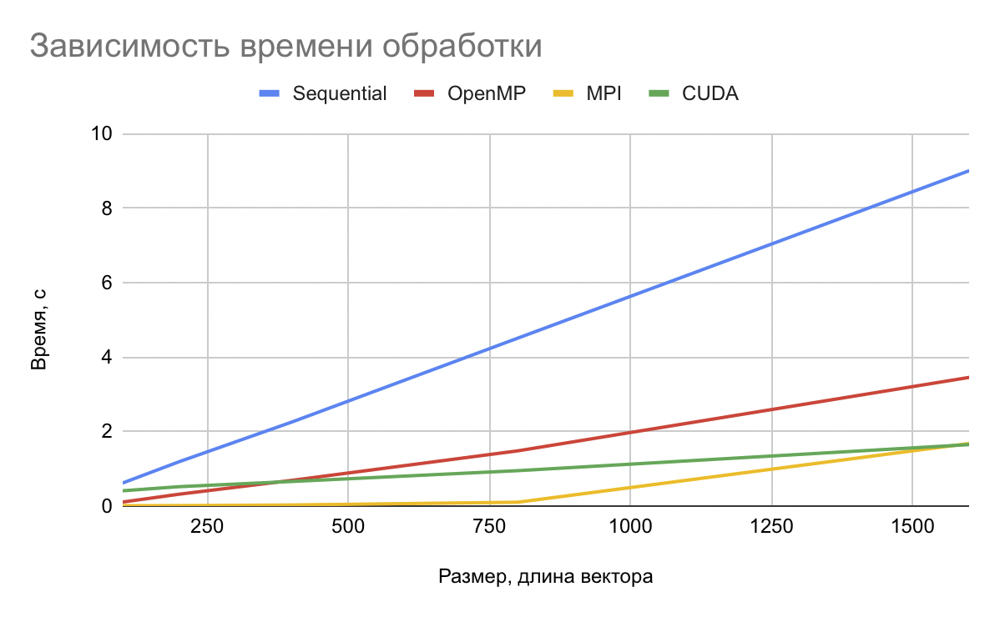
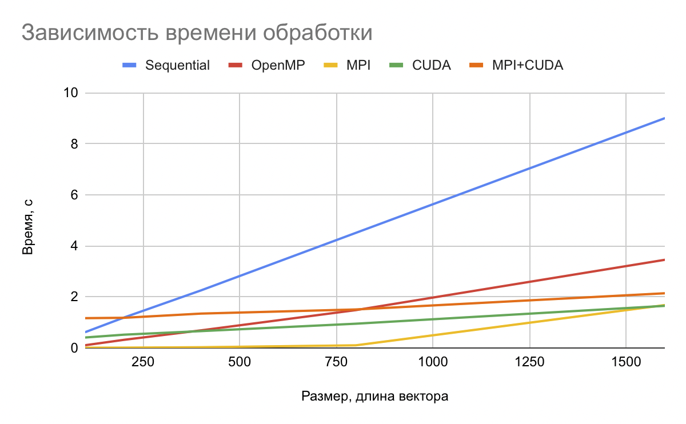

# Гибридные вычисления

## Задание

Расчет N косинусных мер. Входные данные - 2 матрицы NxM (M - длина вектора, N - количество векторов). Результат - вектор косинусных мер.

## Этапы реализации

- Последовательная реализация
- Реализация через OpenMP
- Реализация через MPI
- Реализация на CUDA
- Реализация MPI+CUDA

## Особенности реализации

- Считывание данных происходит из файла (либо данные передаются по протоколу TCP)
- Данные генерируются утилитой, принимающей в качестве параметров размер данных для обработки в мегабайтах и имя файла (TCP хост-порт) куда будут выгружены данные
- Программа выполняет бизнес-логику и записывает результат в выходной файл (отправляет данные на порт возврата результатов программы-генератора по TCP, сохранение файла с результатами осуществляет программа-генератор)
- В конце файла с результатами сохраняется информация о времени выполнения вычислений и размере обработанных данных

## Описание бизнес-логики

Для данного задания на первом этапе выполнена генерация данных в бинарном виде в два файла. Рандомные значения получаются в диапазоне от 0 до 1 с помощью ГПСЧ:

```
unsigned int g_seed = 0x10101010;

void gen_rand(float *a, int count)
{ 
    unsigned int seed = g_seed;
    for (int i = 0; i < count; i++)
    {
        seed = (214013 * seed + 2531011);
        a[i] = seed * (1.f / 4294967296ULL);
    }  
    g_seed = seed;
}
```

Генератор (код в `src/generator`) создает два файла и пишет в них данные для матриц NxM единым блоком
В качестве аргументов принимает ключи

    `-b` размер будет измеряться в байтах
    `-k` размер будет измеряться в килобайтах
    `-h` данные будут записаны в человеко-читаемом виде
    `-l M` длина строки матрицы
    `-s S` размер в мегабайтах (если не указаны -b -k)

Основаная программа читает данные из указанных файлов и выполняет вычисления
Вычислительная логика описана в `src/plain/plain.c`

Алгоритм работы:
- Читается вся матрица в память
- Для всей матрицы:
    - Берем строки из первой и второй матрицы
    - Выполняем расчет косинусного расстояния ( формула (u*v / (sqrt(u*u) * sqrt(u*u))), где * скалярное произвдение )
    - Сохраняем результат в новую матрицу
- Пишем результат в файл


## Графики

### 1. Последовательный вариант

Зависимость времени обработки от размера файла (количества строк)



### 2. Реализация с OpenMP



#### Алгоритм с OpenMP

OpenMP запустит задачу в несколько потоков, чтобы эффективно его применить, надо проанализировать где будет целесообразное распараллеливание. Для этого задачи должны быть независимы, чтобы потоки не ждали друг друга.
В текущей реализации multiply() выполняет умножение для каждого числа из вектора. process() вызывает умножение три раза и одно деление. И наконец clean_process() запускает в цикле перемножение. 
В такой ситуации мы можем выполнить распараллеливание при раскрутке цикла - мы загружаем часть матриц в кэш, и выполняем подсчет итераций параллельно.
Таким образом мы разделим данные на отдельные не связанные потоки и при этом сможем получить пользу от использования многопоочного вычисления.

### 3. Реализация с MPI



#### Алгоритм с MPI

MPI позволяет запустить несколько процессов на многопроцессорной системе (многоядерной). Для этой задачи я создаю количество процессов равное числу ядер в системе, затем читаю все данные в оперативную память в 0 процессе, и с помощью MPI_Scatterv распределяю данные по всем процессам примерно поровну.
Принцип разделения такой:
- На вход получаем количество всех элементов (size) и размер одного вектора (length)
- Вычисляем общее число векторов (vectors_count) в матрице
- Вычисляем base_count (количество векторов на каждом процессе) и получаем что если vectors_count % num_procs не равен 0, то есть remainer векторов которые не попали на обработку. В этом случае для первых процессов (количество равно remainer) увеличиваем base_count на 1
- Полученное распределение векторов отправляем процессам и получаем в итоге vectors_count значений
- Собираем данные также кусками с помощью MPI_Gatherv

В итоге каждый из процессов получает свою последовательную порцию данных по количеству примерно одинаковую с другими процессами.

### 4. Реализация с CUDA



#### Алгоритм с CUDA

Идея заключается в том, чтобы нагрузить GPU. Мы читаем матрицы, которые в памяти представлены в виде единого блока памяти, дальше загружаем их на обработку в устройство. Запускаем выполнение с двумерным разделением - в блоке максимальное количество нитей совпадает с размером строки. Grid состоит из count / размер блока.

### 5. Реализация с MPI + CUDA



#### Алгоритм с MPI + CUDA

Идея совпадает с предыдущими - мы так же разделяем данные между процессами за исключением использования CUDA в 0 процессе. Он получает увеличенную порцию данных. Регулировать добавку данных можно ключом `-g` от 0 до 9
Тут есть возможность для улучшения - 0 процесс может сам считать свои данные пока обработкой дополнительного объема будет заниматься CUDA
